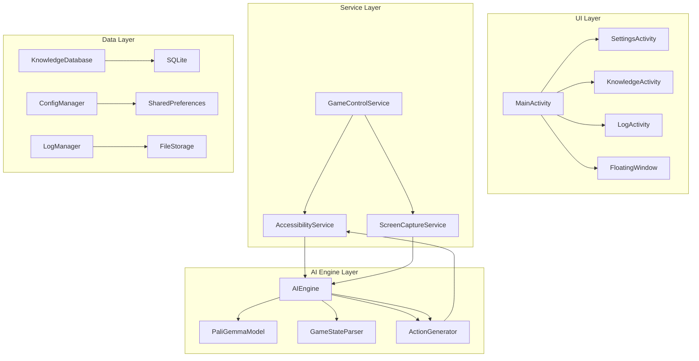
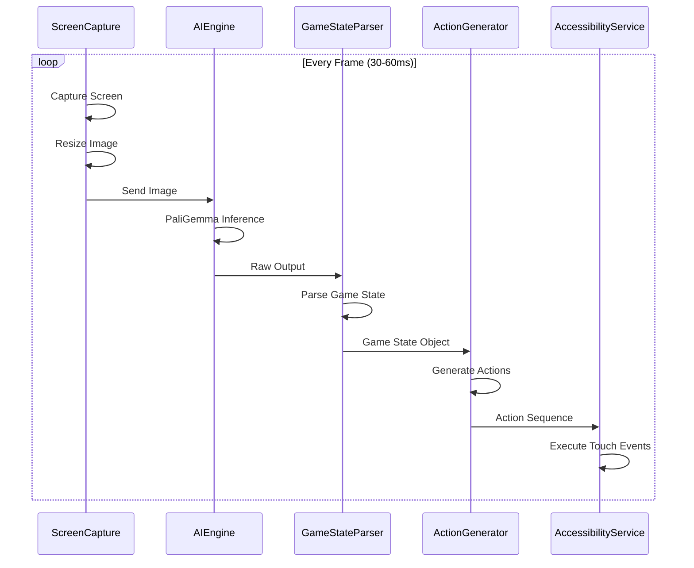
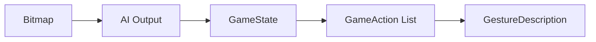
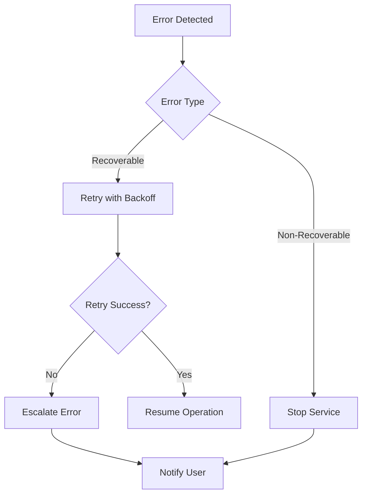

# AI Game Controller - Technical Design Document

Feature Name: ai-game-controller
Updated: 2026-02-22

## Description

AI Game Controller 是一款面向Android平台的本地AI游戏自动化控制应用。该应用通过无障碍服务获取屏幕内容，使用PaliGemma视觉语言模型实时理解游戏画面，自动生成并执行游戏操作。主要针对火炬之光无限等ARPG游戏，支持知识学习、策略配置和流式动作输出。

## Architecture

### System Architecture Overview



### Core Processing Pipeline



## Components and Interfaces

### 1. UI Components

#### 1.1 MainActivity

主界面，提供AI控制的启停操作和状态显示。

```kotlin
interface MainView {
    fun updateStatus(status: RunStatus)
    fun showPermissionRequest()
    fun showMemoryWarning(usedMB: Int, totalMB: Int)
    fun showError(message: String)
}

enum class RunStatus {
    IDLE,           // 空闲
    INITIALIZING,   // 初始化中
    RUNNING,        // 运行中
    PAUSED,         // 暂停
    ERROR           // 错误
}
```

#### 1.2 SettingsActivity

设置界面，管理AI策略和应用配置。

```kotlin
interface SettingsView {
    fun displayCurrentConfig(config: AppConfig)
    fun displayStrategyOptions(strategies: List<Strategy>)
    fun onSaveConfig(config: AppConfig)
}

data class AppConfig(
    val frameRate: Int,           // 10-30 fps
    val resolutionScale: Float,   // 0.25-1.0
    val actionDelay: Int,         // 30-200 ms
    val strategy: StrategyType,
    val autoPickup: Boolean,
    val autoPotionThreshold: Int  // 0-100 %
)

enum class StrategyType {
    AGGRESSIVE,   // 激进型
    BALANCED,     // 平衡型
    CONSERVATIVE  // 保守型
}
```

#### 1.3 KnowledgeActivity

知识库界面，显示和管理AI学习的游戏知识。

```kotlin
interface KnowledgeView {
    fun displaySkills(skills: List<SkillKnowledge>)
    fun displayItems(items: List<ItemKnowledge>)
    fun onConfirmKnowledge(knowledge: Knowledge)
    fun onDeleteKnowledge(id: String)
}

data class SkillKnowledge(
    val id: String,
    val name: String,
    val iconFeature: FloatArray,    // 图标特征向量
    val description: String,
    val cooldown: Int?,             // 冷却时间(ms)
    val effect: SkillEffect,
    val learnTime: Long
)

data class ItemKnowledge(
    val id: String,
    val name: String,
    val iconFeature: FloatArray,
    val attributes: Map<String, Int>,  // 属性加成
    val learnTime: Long
)
```

#### 1.4 FloatingWindow

悬浮窗控制面板，提供快捷操作入口。

```kotlin
interface FloatingWindowController {
    fun show()
    fun hide()
    fun updateStatus(status: RunStatus)
    fun setOnStartListener(listener: () -> Unit)
    fun setOnPauseListener(listener: () -> Unit)
    fun setOnStopListener(listener: () -> Unit)
}
```

### 2. Service Components

#### 2.1 GameControlService

主控制服务，协调各模块运行。

```kotlin
class GameControlService : Service() {
    private val aiEngine: AIEngine
    private val screenCapture: ScreenCaptureService
    private val accessibilityService: GameAccessibilityService
    private val knowledgeDatabase: KnowledgeDatabase
    private val configManager: ConfigManager

    fun start()
    fun pause()
    fun stop()
    fun getStatus(): RunStatus
}
```

#### 2.2 GameAccessibilityService

无障碍服务，负责执行触控操作。

```kotlin
class GameAccessibilityService : AccessibilityService() {

    fun performClick(x: Int, y: Int): Boolean
    fun performLongClick(x: Int, y: Int): Boolean
    fun performSwipe(startX: Int, startY: Int, endX: Int, endY: Int, duration: Long): Boolean
    fun performMultiTouch(touches: List<TouchPoint>): Boolean
    fun performGesture(gesture: GestureDescription): Boolean

    // 获取屏幕尺寸
    fun getScreenSize(): Pair<Int, Int>

    // 检测目标应用是否在前台
    fun isTargetAppForeground(packageName: String): Boolean
}

data class TouchPoint(
    val x: Int,
    val y: Int,
    val startTime: Long,
    val duration: Long
)
```

#### 2.3 ScreenCaptureService

屏幕截图服务，支持高性能截图。

```kotlin
class ScreenCaptureService {

    suspend fun captureScreen(): Bitmap
    suspend fun captureScreenScaled(scale: Float): Bitmap
    fun setFrameRate(fps: Int)
    fun getFrameRate(): Int

    // 使用MediaProjection API (Android 5.0+)
    fun initMediaProjection(resultCode: Int, data: Intent)

    // 备选方案：使用AccessibilityService的rootInActiveWindow
    fun captureViaAccessibility(): Bitmap?
}
```

### 3. AI Engine Components

#### 3.1 AIEngine

AI引擎核心类，管理模型加载和推理。

```kotlin
class AIEngine(private val context: Context) {
    private var model: PaliGemmaModel? = null
    private val gameStateParser: GameStateParser
    private val actionGenerator: ActionGenerator

    suspend fun initialize(): Result<Unit>
    fun isInitialized(): Boolean
    fun getMemoryUsage(): Long

    suspend fun inference(image: Bitmap): Result<GameState>
    suspend fun inferenceStream(image: Bitmap, callback: (GameState) -> Unit)

    fun release()
}
```

#### 3.2 PaliGemmaModel

PaliGemma模型封装，使用TensorFlow Lite或ML Kit。

```kotlin
class PaliGemmaModel(private val context: Context) {
    private var interpreter: Interpreter? = null
    private val options = Interpreter.Options()

    suspend fun loadModel(): Result<Unit>

    fun runInference(image: Bitmap): FloatArray

    // 启用GPU加速
    fun enableGpuAcceleration(): Boolean

    // 启用NNAPI加速 (Android 8.1+)
    fun enableNnApiAcceleration(): Boolean

    // 获取模型输出维度
    fun getOutputShape(): IntArray
}
```

#### 3.3 GameStateParser

游戏状态解析器，将AI输出转换为结构化状态。

```kotlin
class GameStateParser {

    fun parse(aiOutput: FloatArray, screenWidth: Int, screenHeight: Int): GameState

    // 结合知识库增强解析
    fun parseWithKnowledge(aiOutput: FloatArray, knowledge: List<Knowledge>): GameState
}

data class GameState(
    val screenType: ScreenType,
    val playerState: PlayerState?,
    val enemies: List<EnemyInfo>,
    val skills: List<SkillState>,
    val items: List<ItemState>,
    val timestamp: Long
)

enum class ScreenType {
    MAIN_MENU,      // 主菜单
    BATTLE,         // 战斗中
    INVENTORY,      // 背包
    SHOP,           // 商店
    DIALOG,         // 对话
    LOADING,        // 加载中
    UNKNOWN         // 未知
}

data class PlayerState(
    val healthPercent: Int,
    val manaPercent: Int,
    val position: Point,
    val isMoving: Boolean
)

data class EnemyInfo(
    val position: Point,
    val distance: Float,
    val type: EnemyType?,
    val isAggressive: Boolean
)

data class SkillState(
    val index: Int,
    val name: String?,
    val isReady: Boolean,
    val cooldownRemaining: Int
)
```

#### 3.4 ActionGenerator

动作生成器，根据游戏状态生成操作序列。

```kotlin
class ActionGenerator(
    private val config: AppConfig,
    private val knowledge: KnowledgeDatabase
) {

    fun generateActions(state: GameState): List<GameAction>

    // 流式生成动作
    fun generateActionsStream(state: GameState, callback: (GameAction) -> Unit)

    // 紧急回避动作
    fun generateEmergencyAction(state: GameState): GameAction?
}

sealed class GameAction {
    data class Move(val direction: Float, val distance: Float) : GameAction()
    data class UseSkill(val skillIndex: Int, val targetX: Int, val targetY: Int) : GameAction()
    data class UseItem(val itemIndex: Int) : GameAction()
    data class Click(val x: Int, val y: Int) : GameAction()
    data class Wait(val durationMs: Long) : GameAction()
    data class CompositeAction(val actions: List<GameAction>) : GameAction()
}
```

### 4. Data Components

#### 4.1 KnowledgeDatabase

知识库数据库，使用Room封装SQLite。

```kotlin
@Database(entities = [SkillEntity::class, ItemEntity::class], version = 1)
abstract class KnowledgeDatabase : RoomDatabase() {
    abstract fun skillDao(): SkillDao
    abstract fun itemDao(): ItemDao
}

@Dao
interface SkillDao {
    @Query("SELECT * FROM skills")
    suspend fun getAll(): List<SkillEntity>

    @Query("SELECT * FROM skills WHERE name = :name")
    suspend fun findByName(name: String): SkillEntity?

    @Insert(onConflict = OnConflictStrategy.REPLACE)
    suspend fun insert(skill: SkillEntity)

    @Delete
    suspend fun delete(skill: SkillEntity)
}

@Entity(tableName = "skills")
data class SkillEntity(
    @PrimaryKey val id: String,
    val name: String,
    val iconFeature: ByteArray,
    val description: String,
    val cooldown: Int?,
    val effectType: String,
    val effectValue: Int?,
    val learnTime: Long
)
```

#### 4.2 ConfigManager

配置管理器。

```kotlin
class ConfigManager(private val context: Context) {

    fun getConfig(): AppConfig
    fun saveConfig(config: AppConfig)
    fun resetToDefault()

    fun getTargetPackageName(): String
    fun setTargetPackageName(packageName: String)
}
```

#### 4.3 LogManager

日志管理器。

```kotlin
class LogManager(private val context: Context) {

    fun log(level: LogLevel, tag: String, message: String)
    fun logDecision(state: GameState, actions: List<GameAction>)
    fun logError(error: Throwable)

    fun getLogs(level: LogLevel? = null, limit: Int = 50): List<LogEntry>
    fun exportLogs(outputFile: File): Boolean
    fun clearOldLogs(olderThanDays: Int)
}

enum class LogLevel {
    DEBUG, INFO, WARN, ERROR
}

data class LogEntry(
    val timestamp: Long,
    val level: LogLevel,
    val tag: String,
    val message: String
)
```

## Data Models

### Core Data Flow



### Memory Management Strategy

```
+------------------+------------------+------------------+
|     Region       |      Size        |      Usage       |
+------------------+------------------+------------------+
| AI Model         | ~500MB-1GB       | PaliGemma Weights|
| Image Buffer     | ~100MB           | Screen Captures  |
| Knowledge DB     | ~50MB            | Learned Data     |
| Runtime Memory   | ~200MB           | App Runtime      |
+------------------+------------------+------------------+
| Total            | ~850MB-1.35GB    |                  |
+------------------+------------------+------------------+
```

## Correctness Properties

### Invariants

1. **服务生命周期不变量**：如果AI正在运行，则AccessibilityService必须处于活跃状态
2. **内存安全不变量**：总内存占用不得超过3GB
3. **操作安全不变量**：所有触控操作必须在目标应用界面内执行
4. **知识一致性不变量**：知识库中的技能/物品ID必须唯一

### Constraints

1. **帧率约束**：截图帧率必须在10-30fps之间
2. **延迟约束**：从截图到操作执行的延迟不超过300ms
3. **分辨率约束**：处理的图像分辨率不超过原始分辨率的50%

## Error Handling

### Error Categories

| Category | Handling Strategy |
|----------|-------------------|
| Permission Denied | 显示引导界面，引导用户授权 |
| Model Load Failed | 重试3次，失败后显示错误提示 |
| Screen Capture Failed | 重试，超过阈值后暂停服务 |
| Inference Error | 记录日志，重置模型状态 |
| Memory Overflow | 清理缓存，降低分辨率 |
| Target App Exit | 自动暂停AI控制 |

### Error Recovery Flow



## Test Strategy

### Unit Tests

1. **GameStateParser Test**: 验证AI输出解析的正确性
2. **ActionGenerator Test**: 验证动作生成逻辑
3. **KnowledgeDatabase Test**: 验证知识存储和检索
4. **ConfigManager Test**: 验证配置管理

### Integration Tests

1. **Screen Capture + AI Engine**: 验证截图到推理的完整流程
2. **AI Engine + Action Execution**: 验证推理到操作的完整流程
3. **Knowledge Learning Flow**: 验证知识学习完整流程

### Performance Tests

1. **Frame Rate Test**: 验证不同帧率下的稳定性
2. **Memory Test**: 验证长时间运行的内存占用
3. **Latency Test**: 验证端到端延迟

### Manual Tests

1. **Game Scenario Test**: 在实际游戏中验证AI行为
2. **Permission Test**: 验证权限请求和恢复流程
3. **UI Test**: 验证各界面功能和交互

## Implementation Plan

### Phase 1: 基础框架 (Priority: P0)

1. 项目初始化，配置Gradle和依赖
2. 实现AccessibilityService基础框架
3. 实现ScreenCaptureService基础框架
4. 实现主界面UI

### Phase 2: AI模型集成 (Priority: P0)

1. 集成TensorFlow Lite
2. 实现PaliGemma模型加载和推理
3. 实现GameStateParser
4. 实现ActionGenerator

### Phase 3: 核心功能 (Priority: P0)

1. 实现完整的控制循环
2. 实现知识库存储
3. 实现配置管理
4. 实现日志系统

### Phase 4: UI完善 (Priority: P1)

1. 实现设置界面
2. 实现知识库界面
3. 实现日志界面
4. 实现悬浮窗

### Phase 5: 优化与测试 (Priority: P1)

1. 性能优化
2. 内存优化
3. 完整测试
4. Bug修复

## Dependencies

### External Libraries

```gradle
// TensorFlow Lite
implementation 'org.tensorflow:tensorflow-lite:2.14.0'
implementation 'org.tensorflow:tensorflow-lite-gpu:2.14.0'
implementation 'org.tensorflow:tensorflow-lite-support:0.4.4'

// Room Database
implementation 'androidx.room:room-runtime:2.6.1'
implementation 'androidx.room:room-ktx:2.6.1'
ksp 'androidx.room:room-compiler:2.6.1'

// Coroutines
implementation 'org.jetbrains.kotlinx:kotlinx-coroutines-android:1.7.3'

// Lifecycle
implementation 'androidx.lifecycle:lifecycle-runtime-ktx:2.7.0'
implementation 'androidx.lifecycle:lifecycle-viewmodel-ktx:2.7.0'

// UI Components
implementation 'androidx.appcompat:appcompat:1.6.1'
implementation 'com.google.android.material:material:1.11.0'
implementation 'androidx.constraintlayout:constraintlayout:2.1.4'
```

### Minimum Requirements

- Android SDK 26 (Android 8.0)
- Kotlin 1.9+
- Gradle 8.0+
- Target Device: 红米Turbo3 (骁龙8s Gen3, 8GB RAM)

## Security Considerations

1. **数据隔离**：所有数据存储在应用私有目录
2. **权限最小化**：仅请求必要的无障碍权限
3. **无网络通信**：不包含任何网络请求代码
4. **代码混淆**：发布版本启用ProGuard混淆

## References

[^1]: Android AccessibilityService Documentation - https://developer.android.com/reference/android/accessibilityservice/AccessibilityService
[^2]: TensorFlow Lite Documentation - https://www.tensorflow.org/lite
[^3]: PaliGemma Model - https://ai.google.dev/gemma
[^4]: Android MediaProjection API - https://developer.android.com/reference/android/media/projection/MediaProjection
